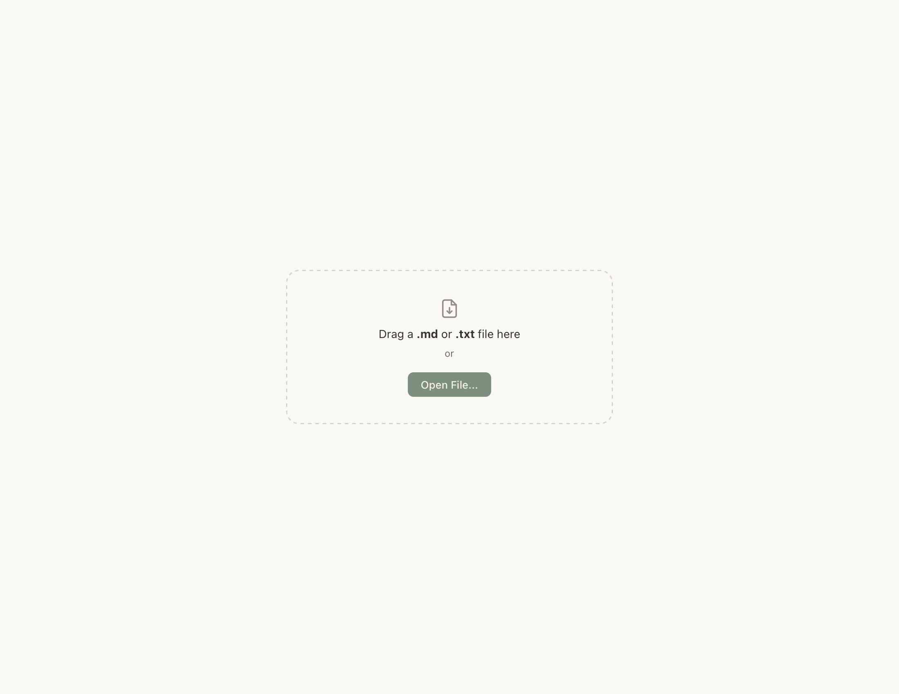
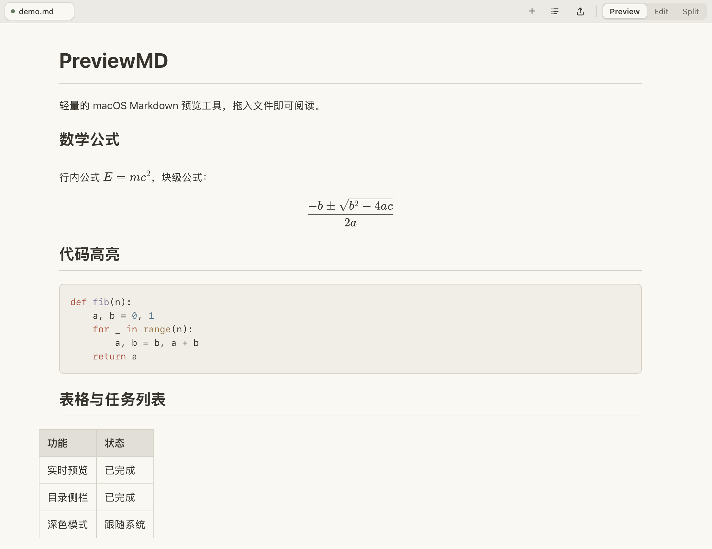

# PreviewMD

macOS 上的 Markdown 预览工具，拖拽 `.md` 或 `.txt` 文件即可渲染预览。

## 功能

- **多标签页** — 同时打开多份文档，点击标签切换，鼠标悬停显示关闭按钮
- **GitHub Flavored Markdown** — 表格、任务列表、删除线、引用块等完整支持
- **代码语法高亮** — 自动检测编程语言并高亮
- **LaTeX 数学公式** — 行内公式 `$E=mc^2$`，块级公式 `$$\frac{-b\pm\sqrt{b^2-4ac}}{2a}$$`
- **文件变化自动刷新** — 用编辑器、脚本或 AI agent 修改 `.md` / `.txt` 后窗口自动更新（拖拽、`+` 按钮和命令行打开的文件都会监听）；另有重载按钮与 `Cmd/Ctrl + R` 可随时强制从磁盘重读
- **会话恢复** — 退出前打开的标签页、当前标签和查看模式会在下次启动时自动恢复（缺失的文件会被跳过）
- **新建与另存为** — `Cmd/Ctrl + N` 新建文档直接开始编辑，`Cmd/Ctrl + S`（或 `Cmd/Ctrl + Shift + S`、导出菜单的 `Save As...`）选择保存位置；保存成功会显示完整路径，且打开/保存对话框默认停在上次用过的文件夹
- **三种查看模式** — `Preview` 只看渲染结果，`Edit` 专注编辑源码，`Split` 同时显示编辑器与实时预览；Split 输入后约 200 ms 更新，窄窗口自动上下排列，并支持双向比例滚动同步
- **每个标签独立的撤销/重做** — `Cmd/Ctrl + Z` 撤销、`Cmd/Ctrl + Shift + Z` 重做；切换标签后历史仍然保留
- **目录侧栏** — 根据 h1–h6 自动生成可折叠目录，点击即可定位，并跟随预览滚动高亮当前章节
- **可靠自动保存** — 有路径的文件编辑后约 1 秒自动保存；清楚标记未保存、外部更新与冲突，冲突时暂停自动保存
- **图片插入与本地预览** — 选择、粘贴或拖入图片，自动放到文档旁的 `assets/`，相对路径图片也能稳定显示
- **图片灯箱** — 点击已成功载入的预览图片放大查看，可用按钮或滚轮缩放，`Escape` 关闭
- **导出与打印** — 导出独立 UTF-8 HTML（本地图片内嵌），或打开 macOS 系统打印对话框后“存储为 PDF”
- **页内搜索** — `Cmd/Ctrl + F` 搜索当前预览或编辑内容，`Enter` / `Shift + Enter` 跳转结果
- **安全渲染** — 预览前会移除脚本、事件属性等危险 HTML，避免不可信 Markdown 触发 WebView 脚本
- **自动跟随系统暗色模式** — 不需要手动切换

## 截图

**空窗口 — 拖拽 .md 文件进来即可预览**



**打开后的渲染效果 — GFM、代码高亮、LaTeX 公式、标签页切换**



---

## 方式一：Python 脚本直接运行

### 1. 环境要求

| 依赖 | 说明 |
|------|------|
| Python 3.9+ | 推荐 3.13 |
| macOS | 使用系统内置的 WKWebView 渲染 |
| pip | Python 包管理器 |

### 2. 安装依赖

```bash
cd preview_md
pip3 install pywebview watchdog
```

这两个包会自动拉取它们的依赖（pyobjc 系列、bottle 等），总共约 6 个包。

| 包 | 用途 |
|---|---|
| `pywebview` | 创建原生 macOS 窗口，内嵌 WKWebView |
| `watchdog` | 监听文件变化，修改后自动刷新预览 |

### 3. 使用

```bash
# 打开空白窗口，拖拽 .md 文件进去
python3 preview.py

# 直接打开指定文件（可同时传多个）
python3 preview.py your-file.md notes.md

# 打开后还可以继续拖入或点 + 打开更多文件
```

### 4. 窗口操作

```
┌─────────────────────────────────────────────────────┐
│ [README.md ×] [notes.md ×]                    [+]   │ ← 标签栏
├─────────────────────────────────────────────────────┤
│                                                     │
│  # 标题                                            │
│  正文内容...                                        │
│                                                     │
└─────────────────────────────────────────────────────┘
```

| 操作 | 方式 |
|------|------|
| 打开文件 | 拖拽 `.md` / `.txt` 到窗口，或点标签栏 `+` 按钮 |
| 新建文档 | `Cmd/Ctrl + N`，或点标签栏的新建图标（空窗口也可点 `New File...`） |
| 保存新文档 | 在未保存的新文档里按 `Cmd/Ctrl + S` 会直接打开“另存为”对话框；也可用 `Cmd/Ctrl + Shift + S` 或导出菜单的 `Save As...` |
| 切换文档 | 点击顶部标签 |
| 关闭文档 | 鼠标悬停标签 → 点 `×`（关闭最后一个会回到空窗口） |
| 查看模式 | `Preview` 只显示渲染结果，`Edit` 只显示编辑器，`Split` 同时显示两者；窄窗口下 Split 会改为上下排列 |
| 目录 | Preview 或 Split 模式下点标签栏的目录图标（TOC）展开/收起目录；点击目录项定位标题，预览滚动时当前标题会高亮 |
| 插入图片 | Edit 或 Split 模式下点标签栏的图片图标，或把图片粘贴/拖到编辑器；未保存的新文档会先请你保存文档，再插入图片 |
| 查看图片 | 点击成功载入的预览图片打开灯箱；`+` / `−` / 百分比按钮或鼠标滚轮缩放，点背景、关闭按钮或按 `Escape` 关闭 |
| 刷新 / 重载 | `Cmd/Ctrl + R`，或点标签栏的旋转箭头按钮：重新从磁盘读取当前文档（同时清掉图片缓存），适合在编辑器、脚本或 AI agent 改完文件后强制同步 |
| 保存编辑 | 有路径的文件停止输入约 1 秒后自动保存；随时可按 `Cmd/Ctrl + S` 明确保存 |
| 撤销 / 重做 | 编辑器聚焦时 `Cmd/Ctrl + Z` 撤销、`Cmd/Ctrl + Shift + Z` 重做；每个标签各自保留历史，切换标签不会丢 |
| 磁盘冲突处理 | 本地有未保存编辑时文件又被外部修改，会显示冲突横幅：`Load disk version` 放弃本地编辑并载入磁盘版本，`Keep my edits` 保留本地内容并继续暂停自动保存 |
| 搜索 | `Cmd/Ctrl + F` 打开搜索；Preview 搜索渲染正文，Edit 和 Split 搜索 Markdown 源码；`Enter` 下一个，`Shift + Enter` 上一个 |
| 导出 HTML | 点标签栏的导出图标 → `Export HTML...`，在系统保存对话框中选位置 |
| 打印 / PDF | 点标签栏的导出图标 → `Print / Save as PDF...` 打开系统打印对话框；在 macOS 对话框左下角的 PDF 菜单选择“存储为 PDF” |
| 自动刷新 | 通过拖拽、`+` 或命令行打开的文件都会被监听：磁盘外部更新会自动载入（蓝点 + 提示），编辑冲突显示红点与横幅；监听之外还有每 2 秒的轻量兜底检查，漏掉系统事件时也能同步 |
| 恢复上次会话 | 下次启动自动重开上次的标签页（需至少打开过一次带路径的文件） |

### 5. 运行测试

```bash
.venv/bin/python -m unittest discover -v
```

---

## 方式二：打包为独立 .app

打包后得到一个独立的应用程序，**不需要安装 Python**，双击即用。

### 1. 准备构建环境

`build.sh` 不再自动全局安装依赖，也不会去猜系统里的 Python。它按以下顺序选择解释器：

1. 环境变量 `PYTHON` 指定的解释器
2. 项目里的 `.venv/bin/python`
3. 同级的 `venv/bin/python`

推荐创建项目虚拟环境并安装依赖：

```bash
python3 -m venv .venv
.venv/bin/python -m pip install -r requirements.txt pyinstaller
```

### 2. 打包

```bash
cd preview_md
bash build.sh
```

产物按版本与架构分目录，例如 `dist/PreviewMD-0.1.0-arm64/`：

| 文件 | 用途 |
|------|------|
| `dist/PreviewMD-<版本>-<架构>/PreviewMD.app` | 应用程序（约 30MB） |
| `dist/PreviewMD-<版本>-<架构>/PreviewMD-<版本>-<架构>.dmg` | 安装包 |

版本号只在 `app_metadata.py` 里维护，改一处即可。

### 3. 使用 .app

```bash
# 双击运行
open dist/PreviewMD-0.1.0-arm64/PreviewMD.app

# 命令行打开指定文件
open -a dist/PreviewMD-0.1.0-arm64/PreviewMD.app your-file.md

# 拖拽 .md 文件到程序图标也可打开
```

如果想放到"应用程序"目录方便以后使用：

```bash
cp -r dist/PreviewMD-0.1.0-arm64/PreviewMD.app /Applications/
```

然后可以右键任意 `.md` 文件 → 打开方式 → 其他 → 选择 `PreviewMD.app`，勾选"始终以此方式打开"，以后双击 `.md` 就能直接用这个 app 打开。打包后的 Info.plist 已声明 `.md` / `.txt` 文档类型并启用了 argv 传递，因此双击文件和把文件拖到 app 图标上都会直接打开对应文档。

---

## 方式三：分发给别人使用

### 1. 准备 DMG 安装包

`build.sh` 会自动完成打包 → 签名 → 生成 DMG 全流程：

```bash
cd preview_md
bash build.sh
```

产物：

| 文件 | 用途 |
|------|------|
| `dist/PreviewMD-0.1.0-arm64/PreviewMD.app` | 应用程序（30MB） |
| `dist/PreviewMD-0.1.0-arm64/PreviewMD-0.1.0-arm64.dmg` | 安装包（~10MB，压缩后） |

把 DMG 发给对方（AirDrop / 网盘 / 邮件）。如果仓库托管在 GitHub，`.github/workflows/build-release.yml` 会在 push / PR 时自动跑测试并构建 DMG 作为 artifact；在 Actions 页面手动触发该 workflow 并勾选 publish，才会创建 GitHub Release（默认不发布）。

### 2. 发送给对方

把 `dist/PreviewMD.dmg` 发给对方（AirDrop / 网盘 / 邮件）。

### 3. 对方如何安装

1. 双击打开 `PreviewMD.dmg`
2. 把 `PreviewMD.app` 拖到 `/Applications` 文件夹
3. **首次打开**：由于没有 Apple Developer 签名，双击可能会被 Gatekeeper 拦截。此时**右键 app → 打开**，在弹出的对话框中点击"打开"即可
4. 之后就正常双击使用了

> **为什么需要右键打开？** `build.sh` 会尝试做 ad-hoc 签名（免费），能减轻 Gatekeeper 的拦截程度。ad-hoc 签名后，macOS 允许用户通过"右键 → 打开"来绕过。如果完全不做签名，新版 macOS 可能根本没有"仍然打开"的按钮。

### 4. 设为 .md 默认打开方式（可选）

对方安装后，右键任意 `.md` 文件 → 打开方式 → 其他 → 选择 `/Applications/PreviewMD.app`，勾选"始终以此方式打开"。

---

## 注意事项

### 拖拽打开 vs 对话框打开

- **拖拽打开**：在有原生拖拽路径的环境（macOS 的 WKWebView）里，会按真实文件打开、自动刷新并允许保存，和 `+` 按钮打开完全等价；拖入多个文件会依次打开（非 `.md` / `.txt` 会被忽略）。
- **`+` 按钮或命令行打开**：始终有完整文件路径，支持自动刷新。适合边写边看。
- 只有在运行环境拿不到真实路径时（例如非 macOS 平台），拖拽才会退化成只读的 FileReader 预览，此时**没有文件路径信息**，不支持自动刷新，也不能保存回磁盘。

### 会话恢复

- 打开或关闭标签、切换标签、切换查看模式时，PreviewMD 会把当前打开的路径列表写入 `~/Library/Application Support/PreviewMD/session.json`。
- 下次启动且没有指定文件时，会自动恢复这些标签页与查看模式；已经不存在的文件会被跳过，未保存的无路径草稿不会被恢复。
- 启动时在命令行指定了文件，或通过双击文件启动，则不会恢复旧会话。
- 会话文件也会记录上次保存/打开文件所在目录，作为下一次文件对话框的默认位置；目录不存在时自动退回系统默认位置。
- 想临时换一个会话文件（测试或多套配置），可设置环境变量 `PREVIEWMD_SESSION_FILE`。

### 编辑与保存

- 有文件路径的标签页：输入后立即显示未保存标记，并在停止输入约 1 秒后自动保存。保存前会核对打开时看到的磁盘版本，写入采用同目录临时文件、同步落盘后原子替换；只有原文件写入成功后，标记才会恢复为已保存。`Cmd/Ctrl + S` 也会等待写入结果。
- 没有文件路径的标签页：编辑内容只保留在当前窗口里；按 `Cmd/Ctrl + S`（或 `Cmd/Ctrl + Shift + S`）打开“另存为”对话框，选定位置后即转为正常文档，自动保存与文件监听随即生效。保存成功后提示会显示完整路径，标签悬停提示也会显示文件位置。
- 打开与保存对话框都会以上次使用的文件夹作为起点；在对话框里选择其他位置后，该位置也会被记住。
- 撤销/重做按“输入停顿”合并成一步，历史存在各自标签里：切换标签、切到 Preview 再回来，`Cmd/Ctrl + Z` 依然能撤销原来的修改；栈有数量与总容量上限，超出后从最早的历史开始丢弃。
- 预览里的本地图片会按文件路径缓存（文件 mtime/大小变化时自动失效）；如果在磁盘上用另一个程序替换了同名图片而窗口没更新，按 `Cmd/Ctrl + R`（或点重载按钮）重新读取当前文档并清掉图片缓存。
- 切换或关闭有路径且未保存的标签时，PreviewMD 会先安全尝试保存；失败时不会静默丢失内容。
- 已保存且没有改动的标签关闭时不会弹任何对话框。从未保存过的新文档如果还有未保存内容，关闭时只做一次“确认丢弃”，不会强制弹出保存对话框。
- 如果文件在本地编辑尚未保存时又被其他程序修改，或保存前的磁盘版本核对失败，标签会显示红色冲突标记、自动保存暂停，并保留当前编辑内容，同时在窗口顶部弹出冲突横幅：点 `Load disk version` 会确认后放弃本地编辑、载入磁盘上的新版本；点 `Keep my edits` 则保留本地内容，继续暂停自动保存。此时按 `Cmd/Ctrl + S` 会先确认是否以当前内容覆盖磁盘版本；自动保存永远不会强制覆盖冲突。
- 没有本地未保存编辑的标签遇到磁盘更新会直接自动载入，不需要关闭重开。自动载入由文件系统监听和 2 秒一次的兜底检查共同完成，AI agent 常用的“临时文件 + rename 覆盖”写法也能识别。
- 标签状态：绿点为当前已保存，黄点为未保存，红点为冲突，蓝点为已从磁盘载入外部更新。窗口标题中的 `●` / `⚠` 也分别提示未保存与冲突。

### HTML 导出与系统 PDF

**Export HTML...** 会先等待当前预览中的本地图片解析完成，再打开原生保存对话框。生成文件是完整的 UTF-8 HTML，包含当前渲染内容与所需样式；PNG、JPEG、GIF、WebP 本地图片会以内嵌 data URL 保存，远程图片仍保留远程地址。导出文件不包含 PreviewMD 的工具栏或应用脚本。

**Print / Save as PDF...** 调用 macOS / WebView 的系统打印功能，打印样式只保留 Markdown 正文。PreviewMD **不会直接生成 PDF**；请在系统打印对话框左下角打开 **PDF** 菜单，再选择“存储为 PDF”。

### 插入与显示图片

进入 Edit 或 Split 模式后，可以用三种方式插入图片：点标签栏的**图片图标**选择文件、从剪贴板粘贴图片，或把图片文件拖到编辑器。若插入前选中了文字，会用选中文字作为图片替代文本；否则会根据文件名生成替代文本。

图片不会存进 PreviewMD 应用或应用缓存。对于磁盘上有路径的文档，PreviewMD 会在文档同级目录按需创建 `assets/`，复制图片后插入 POSIX 相对路径。例如：

```text
notes/
├── meeting.md
└── assets/
    └── 白板 照片.png
```

插入到 `meeting.md` 的 Markdown 路径对应 `assets/白板 照片.png`（源码会按需要对空格和 Unicode 做 URL 编码）。同名文件不会覆盖，后续文件会依次命名为 `白板 照片-2.png`、`白板 照片-3.png`。

仅支持 **PNG、JPEG、GIF、WebP**，单张上限 **20 MB**，不支持 SVG。在尚未保存的新文档里插入图片时，PreviewMD 会先打开“另存为”让你选择文档位置，保存成功后图片立即写入文档旁的 `assets/` 并插入到光标处；取消保存则不会导入任何内容。预览已有文档时，上述格式的相对图片路径会以当前标签页文档所在目录为基准解析；带空格、Unicode、查询参数或片段的路径也可正常处理。

### HTML 安全

PreviewMD 会保留常见 Markdown 生成的 HTML，但会移除 `<script>`、内联事件属性、危险 URL、表单控件等内容。它适合预览普通 Markdown，不建议把它当作完整 HTML 浏览器使用。

预览中的 `http://`、`https://` 与 `mailto:` 链接会交给系统默认应用打开，不会让 PreviewMD 窗口离开当前文档；其他外部导航会被阻止。`#标题-ID` 这类当前文档内链接仍会在预览区域中定位。

### 编码

文件必须为 UTF-8 编码，否则可能出现乱码。绝大多数编辑器的默认编码就是 UTF-8。

### 换行渲染

PreviewMD 启用了 GFM 的 `breaks` 行为：源码里的单个换行会渲染成 `<br>`（视觉上换一行），空行才换段。这对字幕、笔记等"一行一句"的文本友好；如果你在 `.md` 里刻意用"一句一行"的软换行写法，显示时也会每行断开。

### 支持 .md 与 .txt 文件

拖拽到窗口的非 `.md` / `.txt` 文件会被忽略。`.txt` 文件按 Markdown 语法渲染（其中的 `#`、`*`、`_` 等会被解释为 Markdown 符号）。

### macOS Gatekeeper

首次运行打包好的 `.app` 时，macOS 可能会弹窗提示"无法验证开发者"。到 **系统设置 → 隐私与安全性**，点击"仍然打开"即可。

### 多 Python 环境

如果你电脑上装了多个 Python（系统自带 + Homebrew + miniconda 等），`build.sh` 不会自动挑选解释器，也不会替你安装依赖。它按顺序使用：

1. 环境变量 `PYTHON` 指定的解释器
2. 项目里的 `.venv/bin/python`
3. 同级的 `venv/bin/python`

都没有（或缺少依赖）时脚本直接报错退出。指定解释器的方式：

```bash
# 例如用 miniconda
conda activate base
pip3 install -r requirements.txt pyinstaller
PYTHON="$(which python3)" bash build.sh
```

---

## 常见问题

### Q: 打包时报 `ERROR: Could not build wheels for pyobjc-core`

**原因**：系统自带的 Python 3.9 尝试从源码编译 `pyobjc-core`，但新版 Clang 启用了 `-Werror`，把一些未初始化变量的警告当成错误。

**解决**：不要用系统 Python，用带预编译 wheel 的解释器（例如 miniconda 或项目 `.venv`）：

```bash
python3 -m venv .venv
.venv/bin/python -m pip install -r requirements.txt pyinstaller
bash build.sh
```

### Q: 打开 README.md 时 `$...$` 显示奇怪

**原因**：README 中有 `行内 $...$ / 块级 $$...$$` 这种写法，`...` 不是合法的 LaTeX 公式，被 KaTeX 渲染失败。

**解决**：已修复 — PreviewMD 会先保护 `\$` 这种转义美元符号，只在普通正文文本里识别看起来像公式的 `$...$` / `$$...$$`。货币金额如 `$1.75 万亿$`、纯标点如 `$...$`、代码块里的 `$a+b$` 都不会被误渲染。

### Q: 拖拽文件进去没反应

确认拖入的是 `.md` 或 `.txt` 后缀的文件，目前只支持这两种（文件夹和图片会被忽略）。

### Q: 文件修改后窗口没自动刷新

- 拖拽、`+` 按钮或命令行打开的文件都会自动刷新；没有本地未保存编辑时，磁盘更新会直接载入
- 如果标签上有红点或顶部出现冲突横幅，说明这个文档在 PreviewMD 里还有未保存编辑：按 `Load disk version` 或 `Cmd/Ctrl + R` 即可载入磁盘版本，不需要关闭标签
- 如果仍然不刷新，先按 `Cmd/Ctrl + R` 强制从磁盘重载；确认文件确实被保存了（不是仅在编辑器缓存中）
- 从旧版本升级后仍不刷新，可尝试用 `+` 按钮重新打开一次

### Q: 用 AI agent（opencode 等）改文件后怎么同步预览

- 文件有路径且没有未保存编辑时，agent 保存后预览会自动更新（蓝点 + `Reloaded changes from disk.`）
- agent 的临时文件 + rename 覆盖、脚本批量替换都能识别；另有每 2 秒的兜底检查
- 如果你想确认，直接按 `Cmd/Ctrl + R` 或点标签栏的旋转箭头按钮，就会重新从磁盘读取当前文档
- PreviewMD 的自动保存永远不会静默覆盖磁盘上的新版本：有冲突时会暂停自动保存并显示横幅，由你选择保留哪一边

### Q: 下次启动没有恢复上次的标签页

- 只在“没有指定文件”启动时才会恢复；命令行传了文件、或双击文件启动时不恢复
- 只有带路径的标签页会被恢复；`Untitled` 草稿必须先用 `Cmd/Ctrl + Shift + S` 保存
- 会话文件位于 `~/Library/Application Support/PreviewMD/session.json`，删除它即可清空恢复记录
